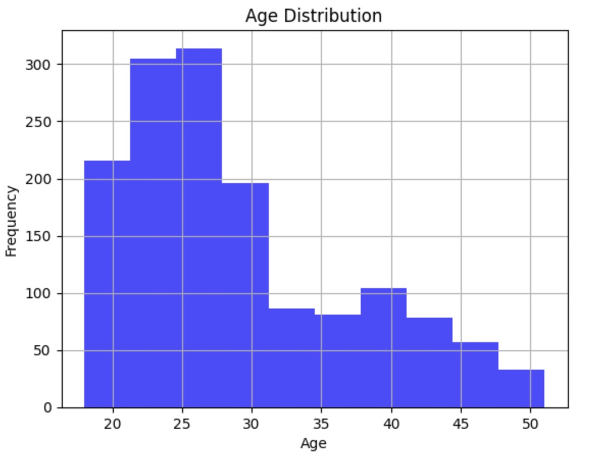

### Employee Statistics Report

#### **Dataset Overview**
This report is based on the employee data obtained from `Employee.csv`. The analysis focuses on two key attributes:
- **Age**
- **Salary**

#### **Statistical Summary**

##### **Age Statistics**
- **Average Age**: The average age of the employees is `29` years.
- **Median Age**: The median age, which represents the middle value in the age distribution, is `26` years.
- **Standard Deviation of Age**: The standard deviation, indicating the amount of variation or dispersion in ages, is `8`.

##### Key Observations from the Histogram
1. **Peak Age Groups**:
   - The most populated age group appears to be between 25 and 30 years old. This group has the highest frequency, with the bar reaching close to 300 employees.
   - There is also significant representation in the age groups immediately younger and older, particularly from 20 to 25 and 30 to 35 years, with these groups also showing high frequencies.

2. **Decreasing Frequency with Age**:
   - The frequency of employees decreases as age increases beyond 30 years. This trend continues with each subsequent age group showing a lesser number of employees compared to the previous one.
   - The bars representing ages 35 to 40, 40 to 45, and 45 to 50 show progressively lower frequencies.

3. **Young Workforce**:
   - The distribution suggests a predominantly young workforce, with a strong representation of employees under 35 years of age.
   - The skew of the histogram is towards the left, indicating that younger age groups dominate the employee demographic.

4. **Tail of the Distribution**:
   - There is a tail extending towards the older age groups, but with significantly lower frequencies, illustrating fewer employees in the 40 to 50 year age range.

##### Statistical Implications
- **Central Tendency**: Given the histogram and the skew towards younger ages, the mean and median are likely below the midpoint of the age range, which aligns with reported statistics of a mean age of 29 years and a median of 26 years.
- **Variability**: The standard deviation of 8 years indicates that while there is a concentration of ages around the mean, there is still considerable spread across different age groups.

##### **Salary Statistics**
- **Average Salary**: The average salary among the employees is `113k`.
- **Median Salary**: The median salary, which divides the salary distribution into two equal halves, is `71k`.
- **Standard Deviation of Salary**: The standard deviation of salaries is `103k`.

#### **Conclusion**
The provided statistics offer insights into the demographics and compensation structure of the workforce. The average and median values give a central tendency of the data, while the standard deviation provides information on the variability of age and salary within the company.
